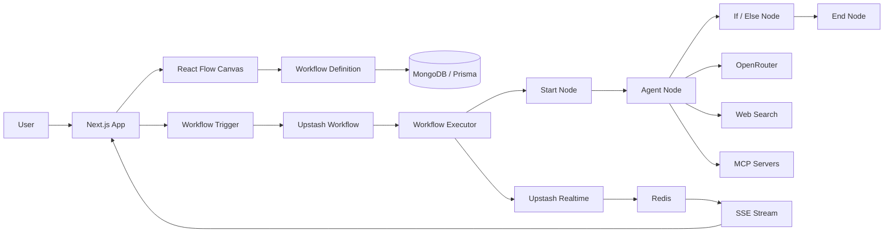
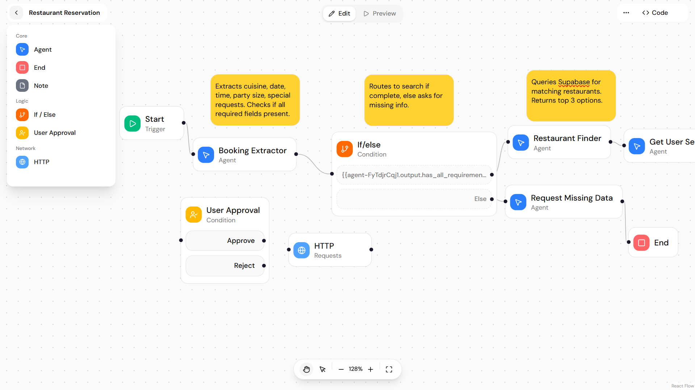
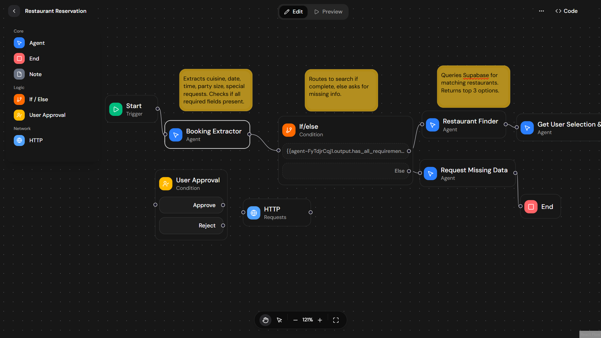

# Flow-AI

> A visual AI agent workflow builder for designing, configuring, and
> executing multi-step AI workflows through a node-based canvas.

[](https://flow-app-agent-builder.vercel.app/)
[](https://github.com/varad-2003/flow-app)

## 🚀 Overview

**Flow-AI** is a full-stack visual workflow platform that lets users
build AI-powered workflows without hard-coding the execution flow.

Workflows are represented as connected nodes on a React Flow canvas.
Each node can perform a specific task, pass its output to downstream
nodes, and participate in conditional branching. AI Agent nodes can use
different LLM models and tools, while workflow execution runs
asynchronously and streams execution updates back to the client in real
time.

The project also includes **MCP (Model Context Protocol)** support,
allowing Agent nodes to connect to external MCP servers and use their
exposed tools.

## ✨ Features

-   🎨 **Visual Workflow Builder** --- Create workflows using a
    drag-and-drop node canvas.
-   🤖 **AI Agent Nodes** --- Configure model, instructions, tools, and
    output format.
-   🔀 **Conditional Branching** --- Use If/Else nodes to route
    execution based on runtime values.
-   ⚡ **Asynchronous Execution** --- Execute workflows through Upstash
    Workflow.
-   📡 **Real-Time Streaming** --- Stream agent output and node
    execution status using Upstash Realtime, Redis, and Server-Sent
    Events (SSE).
-   🧩 **MCP Support** --- Connect external MCP servers and expose their
    tools to Agent nodes.
-   🔎 **Web Search Tool** --- Agent nodes can use a native web-search
    tool.
-   🧠 **Multiple AI Models** --- Model selection is integrated through
    OpenRouter.
-   🧾 **Structured JSON Output** --- Agent nodes can produce
    schema-based JSON responses.
-   🔐 **Authentication & Data Isolation** --- User authentication is
    handled with Kinde, with workflows and MCP servers associated with
    individual users.
-   🔒 **Encrypted MCP Credentials** --- MCP API tokens are encrypted
    before being persisted.
-   💬 **Embeddable Agent UI** --- A separate React/Vite package is
    included for embedding an AI chat interface.
-   ☁️ **Vercel Deployment** --- Designed for serverless deployment with
    Vercel and Upstash services.

## 🧱 Architecture



## 🔄 How Workflow Execution Works

1.  A user creates a workflow on the visual canvas.
2.  Nodes and edges are persisted as a workflow definition in MongoDB.
3.  The workflow is triggered through the Upstash Workflow endpoint.
4.  The executor topologically sorts the graph to determine execution
    order.
5.  Each executable node is resolved through its registered node
    executor.
6.  Node outputs are stored in a shared execution context.
7.  Agent instructions can reference previous node outputs through
    variable replacement.
8.  If an If/Else node is encountered, its conditions are evaluated and
    the matching branch is selected.
9.  Agent text deltas, tool activity, loading states, completion states,
    and errors are emitted through Upstash Realtime.
10. The client receives these events through an SSE endpoint and updates
    the workflow UI in real time.
11. Execution finishes when the End node is reached or there are no
    downstream nodes to execute.

## 🧩 Workflow Nodes

  -----------------------------------------------------------------------
  Node                                Purpose
  ----------------------------------- -----------------------------------
  **Start**                           Entry point for a workflow and
                                      initial user input.

  **Agent**                           Runs an AI model with custom
                                      instructions, tools, and optional
                                      structured output.

  **If / Else**                       Evaluates conditions and selects a
                                      downstream branch.

  **End**                             Terminates workflow execution.

  **HTTP**                            Node type available in the workflow
                                      configuration for HTTP-based
                                      integrations.

  **Comment / Note**                  Adds non-executable notes to the
                                      workflow canvas.
  -----------------------------------------------------------------------

> **Implementation note:** The current executor registry directly
> registers Start, Agent, If/Else, and End executors. The HTTP node is
> defined in the node configuration but is not currently registered in
> `NODE_EXECUTORS`. It can therefore be treated as an extension point
> for future HTTP execution support.

## 🤖 AI Agent Capabilities

Agent nodes support:

-   Configurable system instructions.
-   Model selection through OpenRouter.
-   Native web search.
-   MCP server tools.
-   Multi-step tool usage.
-   Streaming text responses.
-   JSON output with a user-defined response schema.
-   Access to previous workflow outputs through variable replacement.

### Supported model presets

The current project includes presets for:

-   Gemini 2.0 Flash
-   Gemini 2.5 Flash Lite
-   Gemini 2.5 Flash
-   GPT-3.5 Turbo
-   Claude 3 Haiku

Model availability depends on the configured OpenRouter
account/provider.

## 🔌 MCP Integration

Flow-AI supports connecting external MCP servers over HTTP.

The MCP flow is:

``` text
MCP Server URL + API Key
          ↓
   Validate / Discover Tools
          ↓
   Encrypt API Key
          ↓
      MongoDB
          ↓
 Agent selects MCP tools
          ↓
   MCP Client connects
          ↓
     Tool execution
```

MCP credentials are encrypted using **AES-256-GCM** before being stored.

## 📡 Real-Time Execution

The platform uses an event-driven execution pipeline:

``` text
Workflow Execution
       ↓
Upstash Workflow
       ↓
Node Executor
       ↓
Upstash Realtime
       ↓
Redis
       ↓
SSE Endpoint
       ↓
Browser / Workflow UI
```

Agent text is streamed incrementally, while node-level events
communicate states such as:

-   `loading`
-   `complete`
-   `error`
-   text chunks
-   tool calls
-   tool results
-   workflow completion

This keeps the visual workflow state synchronized with the backend
execution.

## 🛠️ Tech Stack

### Frontend

-   Next.js 16
-   React 19
-   TypeScript
-   React Flow / `@xyflow/react`
-   Tailwind CSS
-   shadcn/ui
-   Zustand
-   TanStack React Query

### Backend

-   Next.js App Router
-   Server Actions
-   Upstash Workflow
-   Upstash Realtime
-   Upstash Redis
-   Server-Sent Events (SSE)

### AI

-   Vercel AI SDK
-   OpenRouter
-   MCP / Model Context Protocol
-   Exa web search integration

### Database & Auth

-   MongoDB
-   Prisma ORM
-   Kinde Authentication

### Deployment

-   Vercel
-   Upstash

## 📁 Project Structure

``` text
flow-app/
├── flow-ai/
│   ├── app/
│   │   ├── (routes)/
│   │   ├── actions/
│   │   └── api/
│   ├── components/
│   │   └── workflow/
│   ├── context/
│   ├── features/
│   ├── lib/
│   │   └── workflow/
│   │       └── custom-executors/
│   ├── prisma/
│   │   └── schema.prisma
│   ├── store/
│   ├── types/
│   ├── package.json
│   └── next.config.ts
│
└── embed-chat-react/
    ├── src/
    ├── public/
    ├── package.json
    └── vite.config.ts
```

## ⚙️ Getting Started

### Prerequisites

Make sure you have:

-   Node.js 20+
-   npm
-   MongoDB database
-   OpenRouter API key
-   Upstash Redis
-   Upstash Workflow / QStash credentials
-   Kinde application for authentication
-   An MCP server if you want to use MCP tools

### 1. Clone the repository

``` bash
git clone https://github.com/varad-2003/flow-app.git
cd flow-app
```

### 2. Install dependencies

The main application is inside `flow-ai`:

``` bash
cd flow-ai
npm install
```

### 3. Configure environment variables

Create a `.env` file inside `flow-ai/`.

``` env
DATABASE_URL="your-mongodb-connection-string"

OPENROUTER_API_KEY="your-openrouter-api-key"

UPSTASH_REDIS_REST_URL="your-upstash-redis-rest-url"
UPSTASH_REDIS_REST_TOKEN="your-upstash-redis-rest-token"

QSTASH_TOKEN="your-qstash-token"
QSTASH_BASE_URL="your-qstash-base-url"

VERCEL_PROTECTION_BYPASS_TOKEN="your-vercel-protection-bypass-token"

MCP_SECRET_KEY="64-character-hex-secret"

NEXT_PUBLIC_APP_URL="http://localhost:3000"
```

Configure the Kinde authentication variables required by your Kinde
application as well.

> Never commit real API keys, tokens, database credentials, or
> encryption secrets to GitHub.

### 4. Generate Prisma Client

``` bash
npx prisma generate
```

### 5. Start the development server

``` bash
npm run dev
```

Open:

``` text
http://localhost:3000
```

## 🗄️ Database

The application uses MongoDB through Prisma.

The core data models are:

### Workflow

Stores:

-   User ID
-   Workflow name
-   Description
-   Serialized React Flow nodes and edges
-   Creation/update timestamps

### MCP Server

Stores:

-   User ID
-   Server label
-   Server URL
-   Encrypted API token
-   Creation/update timestamps

## 🔐 Security Considerations

-   Kinde authentication protects application routes.
-   Workflow queries are scoped to the authenticated user.
-   MCP API keys are encrypted using AES-256-GCM before storage.
-   Environment variables are used for server-side secrets.
-   Do not expose `OPENROUTER_API_KEY`, `QSTASH_TOKEN`, Redis tokens, or
    `MCP_SECRET_KEY` to the browser.

## 🌐 Live Demo

**[Launch Flow-AI →](https://flow-app-agent-builder.vercel.app/)**

## 💻 Repository

**[View Source Code →](https://github.com/varad-2003/flow-app)**

## 📸 Screenshots

The repository includes light and dark application previews under:

``` text
flow-ai/public/app-light.png
flow-ai/public/app-dark.png
```

You can add them to this section after pushing the README to GitHub:

``` md



```

## 📦 Embeddable Chat

The repository also contains a separate Vite/React package under:

``` text
embed-chat-react/
```

It provides a reusable chat interface that can be built into the main
application's public embed directory.

Build the embed package with:

``` bash
cd embed-chat-react
npm install
npm run build-embed
```

The generated embed assets are written to:

``` text
flow-ai/public/embed/
```

## 🧠 Engineering Highlights

-   Graph-based workflow execution using topological sorting.
-   Conditional branch selection based on runtime expressions.
-   Shared execution context for passing node outputs downstream.
-   Streaming LLM output through AI SDK full-stream events.
-   Tool-call and tool-result event propagation to the workflow UI.
-   MCP tool discovery and dynamic tool registration.
-   Encrypted persistence of MCP credentials.
-   Server-side workflow execution using Upstash Workflow.
-   Real-time event delivery using Upstash Realtime and Redis.
-   SSE-based client streaming.
-   Prisma-backed workflow persistence.
-   User-scoped workflow access through Kinde authentication.

## 🔮 Future Improvements

Potential areas for further development:

-   Complete HTTP node execution support.
-   Retry and recovery strategies for failed nodes.
-   Workflow versioning and execution history.
-   More built-in integrations and tools.
-   Scheduled workflow execution.
-   Richer execution logs and observability.
-   Additional authentication providers.
-   Workflow templates and sharing.
-   More granular permissions for shared workflows.

## 📄 License

This project is currently maintained as a personal/portfolio project.
Add a formal license file if you intend to allow external reuse or
contributions.

## 👨‍💻 Author

**Varad**

-   GitHub: [@varad-2003](https://github.com/varad-2003)

------------------------------------------------------------------------

⭐ If you find the project interesting, consider giving the repository a
star.
